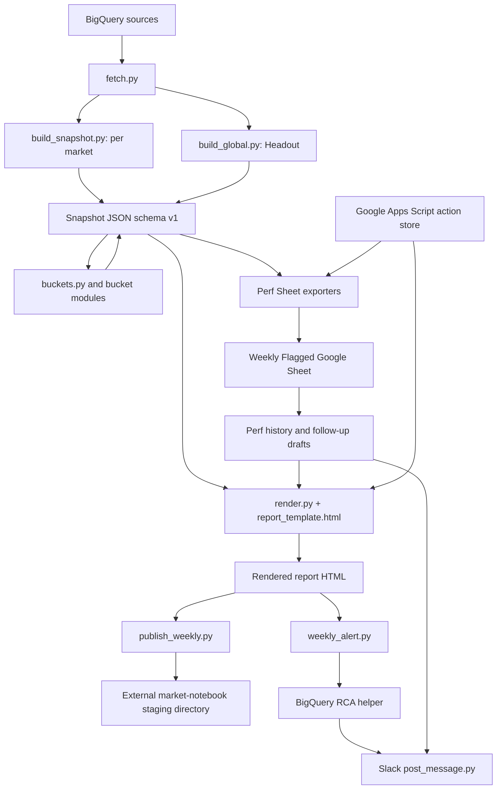

# Weekly Market Report V2 — Current Architecture Baseline

Status: audit baseline, 2026-08-13. This describes the code on `main` at
`d6e4a69`; it is not the desired V2 design.

## System boundary

The repository owns five connected concerns:

1. Query Headout analytics sources and assemble a 12-week CE measurement model.
2. Classify CEs into weekly action buckets.
3. Render per-market and Headout-global interactive HTML reports.
4. Stage the reports into the external market-notebook deployment directory.
5. Operate the Slack and Google Sheets action loop around the report.

The repository does not own the upstream BigQuery models, the external
market-notebook deployment, the Google Apps Script notes service, or Slack.
Reference dbt models in `dbt/` are copies; their canonical home is the analytics
repository.

## Runtime flow

The staged operator entry point is `scripts/weekly_report/run_weekly.py`:

- `report`: build snapshots and render reports.
- Human/agent gate: curate Slack-context sidecars.
- `publish`: reload sidecars, render, and stage the deployment artifacts.
- Human gate: deploy the external market notebook.
- `alert`: generate alerts and RCA; dry-run unless `--post` is supplied.

`scripts/weekly_report/weekly_market_report.py` is the lower-level build and
render orchestrator. The report week is Sunday–Saturday. A supplied date is
snapped to the containing Sunday.

## Layer inventory

### Configuration and data access

- `config.py` owns market coverage, week semantics, metric bases, thresholds,
  BigQuery source names, cost caps, and notes-service configuration.
- `bq.py` creates the BigQuery client and applies query labels and byte caps.
- `fetch.py` contains the query surface for business, ads, metadata, funnel,
  lead-time, channels, tROAS, daily series, and availability data.
- Revenue uses predicted revenue. AOV uses GBV/orders. The main weekly CVR basis
  is paid-ad conversions/clicks; Slack RCA deliberately uses a user-based basis.

### Measurement and snapshot assembly

- `build_snapshot.py` is the principal per-market assembler.
- `build_global.py` duplicates substantial assembly logic for the Headout-wide
  view and caps the CE payload while retaining flagged/mover CEs.
- `flows.py`, `shapley.py`, `alerts.py`, `no_bid.py`, `pp.py`, `seasonality.py`,
  `seasonality_llm.py`, and `levers.py` enrich the measurement layer.
- Snapshots are written under `.cache/weekly_report/` and are intentionally not
  committed.

Current top-level snapshot keys are:

- `meta`, `market_summary`, `ces`, `followup`
- `bucket1_fluctuations`, `bucket_b1`, `bucket_b3`, `bucket_b4`
- `bucket_cascade`, `buckets_final`
- `no_bid_campaigns`, `seasonality_adjustments`, `prepurchase`, `levers`
- `market_review_context`, `transitions`, `_diagnostics`

Although `meta.schema_version` is `1`, this contract has accumulated additive
changes without a machine-enforced schema.

### Bucket logic

There are two generations of bucket output in the same snapshot:

- Legacy modules `bucket_b1.py`, `bucket_b3.py`, and `bucket_b4.py`, plus
  `bucket1_fluctuations`, are still assembled and consumed.
- `buckets.py` reorganizes those and fresh CE measurements into the current
  `buckets_final` Defend/Compound/Lifecycle presentation.

The proposed V2 direction in `bucket-architecture-v2.md` is “monthly = state,
weekly = change”: a shared decomposition substrate feeding Defend, Compound,
New CE, and Prepurchase lanes. That proposal is not yet a clean replacement in
the runtime; the code remains a hybrid of old bucket modules and the reorganized
final output.

### Rendering and publishing

- `render.py` performs light validation, injects one or more snapshots into the
  self-contained `template/report_template.html`, and attaches Slack-context
  and Perf-history sidecars at render time.
- The HTML template contains a large amount of presentation and interaction
  behavior, including action capture through the Apps Script service.
- `publish_weekly.py` copies/stages report pages and writes the external
  notebook's weekly state and matrix. It does not deploy; deployment is a user
  gate.

### Action loop and external systems

- GM actions live in the Google Apps Script action store and are keyed by
  market, CE, week, and bucket.
- Perf actions currently live in the Weekly Flagged Google Sheet. The exporter
  preserves Perf cells by CID and stable row order to prevent positional drift.
- `perf_history.py` reads weekly tabs into a cache sidecar for the report drawer.
- `export_full_lm.py` and `export_perf_sheet.py` write Google Sheets.
- `weekly_alert.py` parses the report payload; `weekly_rca_helper.py` performs a
  separate user-based BigQuery diagnosis; `post_message.py` posts or updates
  Slack and records a local ledger.
- `thursday_actions_ping.py`, `followup_actioning.py`, and `post_followups.py`
  support the close-the-loop workflow.

## Write and approval boundaries

| Operation | Default safety behavior | External effect |
|---|---|---|
| Build snapshot | Writes ignored local cache | BigQuery read |
| Render | Writes generated HTML | None |
| Publish stage | Writes external notebook directory | No deployment |
| Perf/LM export | Dry-run or explicit write; main guard in Perf export | Google Sheet mutation |
| Alert stage | Dry-run unless `--post` | Slack posts/updates |
| Follow-up generator | Draft-only | Google Sheet read |
| Follow-up poster | Explicit separate command | Slack posts/updates |
| Deployment | Printed for the user to run | Production website |

These boundaries must remain explicit in V2. A new “one command” workflow must
not silently cross Sheet, Slack, or deployment gates.

## Current architectural risks

1. **No executable snapshot contract.** Consumers depend on nested dictionaries
   and tolerate missing keys, so incompatible changes can render partial output.
2. **Duplicated per-market/global assembly.** V2 logic can diverge between
   `build_snapshot.py` and `build_global.py`.
3. **Hybrid bucket generations.** Legacy and final buckets coexist, which makes
   ownership and removal order unclear.
4. **Validation is stale.** The NA reference gate predates the L3W fluctuation
   re-cut and Sunday week boundary, so it is not a trustworthy release gate.
5. **Very limited automated tests.** Validation is mostly live builds, dry-runs,
   handoff records, and `stress_test.py`; there is no conventional test suite.
6. **Metric-basis plurality.** Report measurement and Slack RCA intentionally use
   different CVR/traffic bases, but this can look like an inconsistency unless
   provenance is explicit at every consuming surface.
7. **Operational state outside Git.** Cache sidecars, the action store, Sheet
   tabs, Slack ledgers, and the deployment directory participate in behavior.
8. **Large modules and template.** Core assembly, fetch, bucket logic, alerts,
   and the HTML template concentrate change risk.
9. **Best-effort optional modules.** Several enrichment failures are logged and
   skipped, which protects weekly delivery but can hide coverage regressions.
10. **Historical documents are partially stale.** Recent commits have already
    completed some items still marked open in handoffs and plans.

## V2 design constraints

- Preserve Sunday–Saturday semantics and metric provenance unless a backlog item
  explicitly changes them.
- Give the snapshot an executable, versioned contract before changing multiple
  consumers.
- Make the shared measurement substrate independent from bucket routing.
- Use one assembly path for market and global builds where feasible.
- Preserve V1 reproduction fixtures while V2 is under construction.
- Keep external mutations explicit, dry-runnable, main-only where appropriate,
  and idempotent.
- Key all cross-system human input by stable identity (`market`, `ce_id`, week,
  bucket/lane), never row position.
